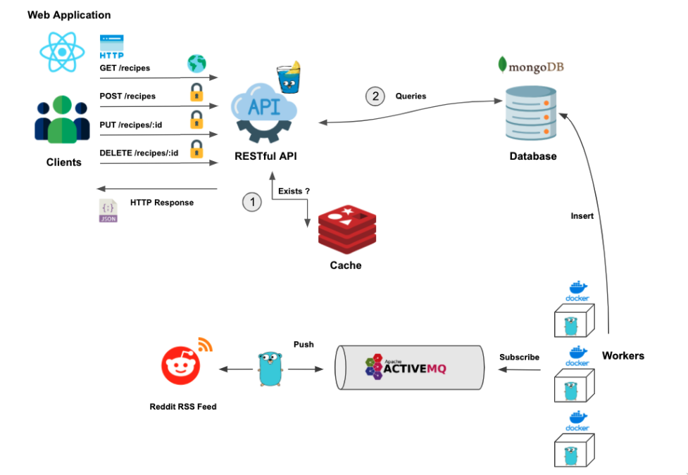

# godwagin
A distributed web application written in Go and Gin Framework.

Application Architecture:



Current Functionalities:

- REST API Endpoints:

```
GET    /recipes
POST   /login
POST   /refresh
POST   /logout

Secured Endpoints:

Methods used for securing API endpoints:

- API-Key method
- JWTs
- Cookie based auth
- Auth0 Implementation

[SECURED]
POST   /recipes
PUT    /recipes/:id
DELETE /recipes/:id
GET    /recipes/:id
```

- 100% Mongo Integration (API Endpoints completely functional with MongoDB)
- Redis Caching Integration (Fully functional)